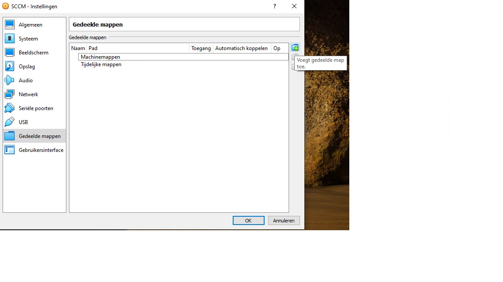

# Gedeelde map toevoegen

In virtualbox kan je een gedeelde map toevoegen via `Apparaten` --> `Gedeelde mappen` --> `Instellingen gedeelde mappen...`

Maak een nieuwe gedeelde map aan met de knop rechts

Vul het dialoogvenster in:

- Pad naar map: Map dat je wil delen (bevindt zich op het host systeem (jouw computer dus))
- Naam van map: naam van de gedeelde map binnen de virtuele machine
- vink automatisch koppelen aan
- koppelpunt: stel dit in op `F:/`, anders hebben we later problemen bij het uitvoeren van de scripts.
- vink permanent maken aan.

