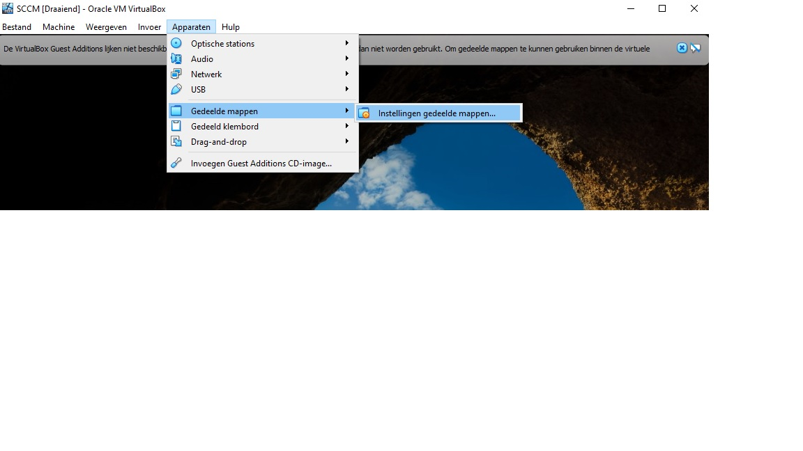

# Handleiding Windows Server 2

- [Handleiding Windows Server 2](#handleiding-windows-server-2)
  - [Algemeen](#algemeen)
    - [Virtuele machine aanmaken](#virtuele-machine-aanmaken)
    - [Installatie Windows Server 2019](#installatie-windows-server-2019)
      - [De vm opstarten](#de-vm-opstarten)
    - [Gedeelde map toevoegen](#gedeelde-map-toevoegen)
    - [Script uitvoeren](#script-uitvoeren)
  - [Domeincontroller (EP1-DC-ALFA)](#domeincontroller-ep1-dc-alfa)
    - [Domeincontroller: Initial Setup](#domeincontroller-initial-setup)
    - [Active Directory Domain Services (ADDS)](#active-directory-domain-services-adds)
    - [DNS](#dns)
      - [Nat routing](#nat-routing)
    - [DHCP](#dhcp)
  - [Webserver (EP1-WEB)](#webserver-ep1-web)
    - [Webserver: Initial Setup](#webserver-initial-setup)
    - [Webserver: Join Domain](#webserver-join-domain)
    - [Webserver: installatie rollen](#webserver-installatie-rollen)
  - [Deploymentserver (EP1-SCCM)](#deploymentserver-ep1-sccm)
    - [Deploymentserver: Initial Setup](#deploymentserver-initial-setup)
    - [Deploymentserver: Join Domain](#deploymentserver-join-domain)
    - [Deploymentserver: installatie benodigdheden](#deploymentserver-installatie-benodigdheden)
    - [Delegate control](#delegate-control)
  - [Certificatieserver (EP1-CA)](#certificatieserver-ep1-ca)
    - [Certificatieserver: Initial Setup](#certificatieserver-initial-setup)
    - [Certificatieserver: Join Domain](#certificatieserver-join-domain)
    - [Certificatieserver: installatie benodigdheden](#certificatieserver-installatie-benodigdheden)

## Algemeen

Alles wat onder algemeen te vinden is kan je toepassen op alle server die binnen de opdracht vallen van Windows Server 2

### Virtuele machine aanmaken

Maak binnen de hypervisor naar keuze een virtuele machine aan met volgende specificaties:

- 1 processorkern
- minimum 2 Gb werkgeheugen
- 1 netwerkadapter op "Intern netwerk"

> Opgelet! Als je een domeincontroller wil maken kies je voor 2 netwerkadapters:
>
> - 1 Nat netwerkadapter
> - 1 Intern netwerkadapter
>
> Opgelet! Indien je een domeincontroller wil maken zorg dat dat de nat netwerkadapter op adapter 1 staat. Anders gaat het [initial setup](../scripts/domeincontroller/1_initial_setup.ps1) script de adapters fout configureren.

### Installatie Windows Server 2019

Nadat je de virtuele machine hebt aangemaakt kan je het besturingssysteem installeren (in ons geval is dit Windows Server 2019)

Heb je nog niet een virtuele machine aangemaakt dan kan je dit doen aan de hand van volgende handleiding, [Virtuele machine aanmaken](#virtuele-machine-aanmaken)

Om te beginnen moet je de het installatiebestand (.iso) toevoegen aan de opslag van de vm (virtuele machine). Dit kan je doen in VirtualBox door de instellingen te openen van de vm en te navigeren naar het tabje "Opslag".

#### De vm opstarten

- Start de vm op.
- Doorloop de wizard voor het installeren van Windows Server 2019
- Klik op "Install now"
- Selecteer de gepaste versie die je wilt installeren, in ons geval is dit "Windows Server 2019 Standard (Desktop Experience)".
  - Wij nemen hier de Desktop Experience omdat we een grafische user interface willen.
- Lees en accepteer, indien u akkoord bent, de license terms.
- Kies voor "Custom: Install Windows Only (Advanced)"
- Selecteer de schijf/partitie waarop u Windows wil installeren en kies vervolgens voor next
- Wacht tot de installatie voltooid is.
- Kies een wachtwoord voor het administrator account. Ik koos `Admin2021` als wachtwoord.

Nu is het besturingssysteem geïnstalleerd. Als je VirtualBox gebruikt gelieve dan ook de Guest additions te installeren zodat we in de toekomst gedeelde mappen kunnen gebruiken.

### Gedeelde map toevoegen

In virtualbox kan je een gedeelde map toevoegen via `Apparaten` --> `Gedeelde mappen` --> `Instellingen gedeelde mappen...`



Maak een nieuwe gedeelde map aan met de knop rechts


Vul het dialoogvenster in:

- Pad naar map: Map alle scripts zich bevinden op je lokale computer.
- Naam van map: naam van de gedeelde map binnen de virtuele machine
- vink automatisch koppelen aan
- koppelpunt: stel dit in op `F:\`, anders hebben we later problemen bij het uitvoeren van de scripts.
- vink permanent maken aan.


### Script uitvoeren

Navigeer naar `F:\` binnen de virtuele machine.

>De scripts zijn _logisch_ ingedeeld per computer, wil je een _domeincontroller_ installeren navigeer dan naar `F:\domeincontroller` wil je een script uitvoeren dat algemeen is? bijvoorbeeld [join_domain.ps1](../scripts/algemeen/join_domain.ps1) zoek dan in de map _algemeen_


Om een script uit te voeren selecteer je het script en via _rechtermuisklik_ selecteer je _Run with Powershell_


## Domeincontroller (EP1-DC-ALFA)

Om een domeinstructuur op te zetten hebben we een domeincontroller nodig. Deze gaat er ook voor zorgen dat er internet beschikbaar is binnen ons netwerk.

> Alle scripts voor de domeincontroller bevinden zicht in `F:\domeincontroller`

### Domeincontroller: Initial Setup

Na een clean install van het besturingssysteem, in ons geval Windows Server 2019, kan je overgaan tot het instellen van hostname, netwerkadapters, ... Dit doen we met het script [1_initial_setup.ps1](../scripts/domeincontroller/1_initial_setup.ps1). De configuratie hiervan kan je eventueel aanpassen in het [settingsbestand](../scripts/domeincontroller/settings.json). Na het uitvoeren van het script zal de computer automatisch herstarten.

Het [initial setup](../scripts/domeincontroller/1_initial_setup.ps1) script gaat:

- computernaam instellen
- Windows updates uitschakelen __(in een productieomgeving is dit ten zeerste afgeraden)__
- Netwerkadapters goed instellen
  - Ip-adressen instellen (statisch of via dhcp)
  - Naamgeving van netwerk adapters
  - IPv6 uitschakelen

```json
{
    "Hostname": "EP1-DC-ALFA",
    "Network": [
        {
            "Name": "WAN",
            "DHCP": "True",
            "IPAdress": ""
        },
        {
            "Name": "LAN10",
            "DHCP": "False",
            "IPAdress": "192.168.10.200"
        }
    ]
}
```

### Active Directory Domain Services (ADDS)

Active directory maakt het mogelijk om gebruikersaccounts aan te maken op netwerk. Hiermee kan elke gebruiker inloggen op een computer binnen het netwerk met zijn eigen account.  
Als je bijvoorbeeld denkt aan een schoolomgeving. Iedere student heeft zijn eigen account en meldt zich aan op een computer van de school. Als hij zich inlogt in lokaal A en daar een word-document maakt dan is het mogelijk dat hij in lokaal B kan verderwerken aan het word-document.  
Het script [2_adds.ps1](../scripts/domeincontroller/2_adds.ps1) zorgt ervoor dat de role `Active Directory Domain Services` geinstalleerd en geconfigureerd wordt.  
Het gaat de rol `Active Directory Domain Services` installeren en daarna de server promoveren naar een domeincontroller.  
Tijdens de promotie worden de domeinnaam, netbiosnaam en safemode administrator wachtwoord ingesteld uit de [algemene settings](../scripts/settings.json).  
De computer zal opnieuw opstarten en vanaf dan kan je inloggen met het domain administrator account:

- gebruikersnaam: `EP1-PIETER\Administrator`
- Wachtwoord dat je gekozen hebt, bij mij is dit `Admin2021`

```json
{
    "ADDS": {
        "DomainName": "EP1-PIETER.hogent",
        "NetBiosName": "EP1-PIETER",
        "password": "Admin2021"
    }
}
```

| Variabele     | Uitleg                                                                                                                                                 |
| :------------ | :----------------------------------------------------------------------------------------------------------------------------------------------------- |
| `DomainName`  | Domeinnaam. Hier vul je de naam in dat je wil instellen voor het domein.                                                                               |
| `NetBiosName` | Netbiosnaam. Dit kan je vergelijken met een roepnaam. als ik wil inloggen als domeinadministrator gebruik ik de netbiosnaam `EP1-PIETER\Administrator` |
| `password`    | Dit is een wachtwoord dat je moet gebruiken als de computer opstart in Safe mode, of een variant hiervan.                                              |

### DNS

Voer het script [3_dns_routing.ps1](../scripts/domeincontroller/3_dns_routing.ps1) uit zodat dns geconfigureerd wordt.  
Dit gaat een reverse lookupzone aanmaken en de server configureren als nat router.

Voer het script [3_dns_routing.ps1](../scripts/domeincontroller/3_dns_routing.ps1) uit zodat dns geconfigureerd wordt.  
Dit gaat een reverse lookupzone aanmaken en daarna de rol `Remote access` installeren. De instellingen hiervan kan je vinden in het [algemene settingsbestand](../scripts/settings.json)

Nadat het script uitgevoerd is moeten we het _Ptr record_ genereren. Navigeer hiervoor naar _Tools_ --> _DNS_ in de server manager.  
Navigeer naar de forward lookup-zone `EP1-PIETER.hogent` en zoek het record met als data het ip adres van de LAN10 interface. (`192.168.10.200`). Open het eigenschappenvenster met rechtermuisklik en vink _Update associated pointer (PTR) record_ aan.


> Een _reverse lookup zone_ zorgt ervoor dat een IP-adres omgezet wordt naar de juist netwerk naam.

#### Nat routing

Configureer de domeincontroller als een nat router.
Dit doe je via _Servermanager_ --> _Tools_ --> _Routing and Remote Access_

Rechtermuisklik op `EP1-DC-ALFA (local)` en kies voor _Configure and Enable Routing and Remote Access_


Doorloop de wizard en kies voor _Network address translation (NAT)_

  

En selecteer dan de interface naar het internet, bij ons is dit `WAN`.  


Doorloop verder de wizard.

```json
{
    "DNS": {
        "NetworkID": "192.168.10.0/24"
    }
}
```

| Variabele   | Uitleg                        |
| :---------- | :---------------------------- |
| `NetworkID` | Het netwerkID in CIDR-notatie |

### DHCP

Om de domeincontroller IP adressen te laten uitdelen moeten we hiervan een DHCP-server maken. Dit kan je doen met het script [4_DHCP.ps1](../scripts/domeincontroller/4_dhcp.ps1).
Dit zorgt er voor dat de rol DHCP server zal geinstalleerd worden alsook het aanmaken van een DHCP scope waar kan instellen welke addressen er worden uitgedeeld en welke niet. Wat er precies zal geconfigureerd worden kan je vinden in het [settingsbestand](../scripts/domeincontroller/settings.json).

```json
{
    "DHCP": {
        "scopeName": "HoGent-EP1",
        "ScopeDescr": "De scope voor het toewijzen van ip-adressen in het netwerk.",
        "scopeStartIp": "192.168.10.100",
        "scopeEndIp": "192.168.10.150",
        "scopeSubnetMask": "255.255.255.0",
        "scopeLease": "8.00:00:00"
    }
}
```

| Variabele         | Uitleg                                                                                              |
| :---------------- | :-------------------------------------------------------------------------------------------------- |
| `scopeName`       | De naam van de DHCP-scope die je gaat aanmaken.                                                     |
| `ScopeDescr`      | Een gepaste beschrijving voor die scope die je gaat aamaken.                                        |
| `scopeStartIp`    | Het __begin__ van de range van ip-adressen die de dhcp server mag uitdelen.                         |
| `scopeEndIp`      | Het __einde__ van de range van ip-adressen die de dhcp server mag uitdelen.                         |
| `scopeSubnetMask` | Het subnetmask van de ip adressen die de dhcp scope mag uitdelen.                                   |
| `scopeLease`      | De lease tijd is hoelang de dchp server een ip-adres mag "uitlenen" voor het moet vernieuwd worden. |

## Webserver (EP1-WEB)

> Alle scripts voor de webserver bevinden zicht in `F:\webserver`

### Webserver: Initial Setup

Na een [clean install](#installatie-windows-server-2019) van het besturingssysteem, in ons geval Windows Server 2019, kan je overgaan tot het instellen van computernaam, ip-adressen, ... Dit doen we met het script [1_initial_setup.ps1](../scripts/webserver/1_initial_setup.ps1). De configuratie hiervan kan je eventueel aanpassen in het [settingsbestand](../scripts/webserver/settings.json).

Het [initial setup](../scripts/Webserver/1_initial_setup.ps1) script gaat:

- Hostname instellen
- Windows updates uitschakelen __(in een productieomgeving is dit ten zeerste afgeraden)__
- Netwerkadapters goed instellen
  - Ip-adressen instellen (statisch)
  - Naamgeving van netwerk adapters
  - IPv6 uitschakelen

```json
{
    "Hostname": "EP1-WEB",
    "Network": [
        {
            "Name": "LAN10",
            "DHCP": "False",
            "IPAdress": "192.168.10.220"
        }
    ]
}
```

### Webserver: Join Domain

Om het domein te joinen voer je het script [Join_domain.ps1](../scripts/algemeen/join_domain.ps1) uit. Na het uitvoeren van het script zal de computer automatisch herstarten.

> Opgelet! Dit script bevindt zich in `F:\algemeen`

nadat dit uitgevoerd is en de computer herstart is kan je inloggen met het netwerk administrator account `EP1-PIETER\Administrator`

### Webserver: installatie rollen

Om de benodigde rollen te installeren voer je het script [2_install_webserver.ps1](../scripts/webserver/2_install_webserver.ps1) uit. Dit gaat alle nodige rollen installeren maar nog niet configureren.

## Deploymentserver (EP1-SCCM)

> Alle scripts voor de deploymentserver bevinden zicht in `F:\deploymentserver`

### Deploymentserver: Initial Setup

Na een [clean install](#installatie-windows-server-2019) van het besturingssysteem, in ons geval Windows Server 2019, kan je overgaan tot het instellen van computernaam, ip-adressen, ... Dit doen we met het script [1_initial_setup.ps1](../scripts/webserver/1_initial_setup.ps1). De configuratie hiervan kan je eventueel aanpassen in het [settingsbestand](../scripts/webserver/settings.json).

Het [initial setup](../scripts/deploymentserver/1_initial_setup.ps1) script gaat:

- Hostname instellen
- Windows updates uitschakelen __(in een productieomgeving is dit ten zeerste afgeraden)__
- Netwerkadapters goed instellen
  - Ip-adressen instellen (statisch)
  - Naamgeving van netwerk adapters
  - IPv6 uitschakelen

```json
{
    "Hostname": "EP1-SCCM",
    "Network": [
        {
            "Name": "LAN10",
            "DHCP": "False",
            "IPAdress": "192.168.10.225"
        }
    ]
}
```

### Deploymentserver: Join Domain

Na de [Initial Setup](#deploymentserver-initial-setup) is het tijd om het domein te joinen. hiervoor voer je het script [Join_domain.ps1](../scripts/algemeen/join_domain.ps1) uit. Na het uitvoeren van het script zal de computer automatisch herstarten.

> Opgelet! Dit script bevindt zich in `F:\algemeen`

Nadat dit uitgevoerd is en de computer herstart is kan je inloggen met het netwerk administrator account `EP1-PIETER\Administrator`

### Deploymentserver: installatie benodigdheden

Nu gaan we de nodige programma's downloaden:

Download [deze programma's](https://hogent-my.sharepoint.com/:u:/g/personal/pieter_vankeer_student_hogent_be/ETf9xuuoCyZCuZoH5EAtA_cB4-VkWMSh0dkNX4TV0-BIjQ?e=B1QIyu) en plaats deze in de map `scripts/configfiles`.

### Delegate control

> Deze stap moet gebeuren op de Domeincontroller.

Ga binnen de __Domeincontroller__ naar _Server manager_ --> _Tools_ --> _Active directory Users and Computers_


Selecteer _view_ --> _advanced Features_


Navigeer nu naar _System_ en zoek voor een container genaamd _System Management_


Rechtermuisklik op deze container en selecteer _Delegate Control_

Een wizard opent. Doorloop deze wizard.

Klik op _add_


Verander _Object types_ zodat _computers_ aangevinkt is.  
Typ vanonder in het invulveld `EP1-SCCM` (dit is de computernaam van de Deploymenyserver) en klik daarna op _Check names_

> Als de computer gevonden is dan zal deze onderstreept zijn.  

Klik op _ok_ om verder te gaan en klik daarna op _Next_


## Certificatieserver (EP1-CA)

> Alle scripts voor de certificatieserver bevinden zicht in `F:\certificaatserver`

### Certificatieserver: Initial Setup

Na een [clean install](#installatie-windows-server-2019) van het besturingssysteem, in ons geval Windows Server 2019, kan je overgaan tot het instellen van computernaam, ip-adressen, ... Dit doen we met het script [1_initial_setup.ps1](../scripts/certificaatserver/1_initial_setup.ps1). De configuratie hiervan kan je eventueel aanpassen in het [settingsbestand](../scripts/certificaatserver/settings.json).

Het [initial setup](../scripts/deploymentserver/1_initial_setup.ps1) script gaat:

- Hostname instellen
- Windows updates uitschakelen __(in een productieomgeving is dit ten zeerste afgeraden)__
- Netwerkadapters goed instellen
  - Ip-adressen instellen (statisch)
  - Naamgeving van netwerk adapters
  - IPv6 uitschakelen

```json
{
    "Hostname": "EP1-CA",
    "Network": [
        {
            "Name": "LAN10",
            "DHCP": "False",
            "IPAdress": "192.168.10.230"
        }
    ]
}
```

### Certificatieserver: Join Domain

Na de [Initial Setup](#certificatieserver-initial-setup) is het tijd om het domein te joinen. hiervoor voer je het script [Join_domain.ps1](../scripts/algemeen/join_domain.ps1) uit. Na het uitvoeren van het script zal de computer automatisch herstarten.

> Opgelet! Dit script bevindt zich in `F:\algemeen`

nadat dit uitgevoerd is en de computer herstart is kan je inloggen met het netwerk administrator account `EP1-PIETER\Administrator`

### Certificatieserver: installatie benodigdheden

Nadat de [computer in het domein](#certificatieserver-join-domain) zit kan je overgaan tot nodige rollen te installeren. Dit kan je doen met het script [2_install_ca.ps1](../scripts/certificaatserver/2_install_ca.ps1)

Dit script gaat de rol `Active Directory Certificate Services` installeren.
