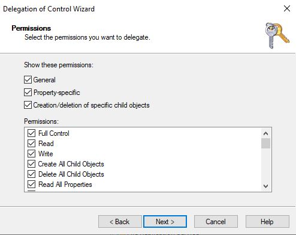
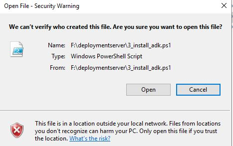
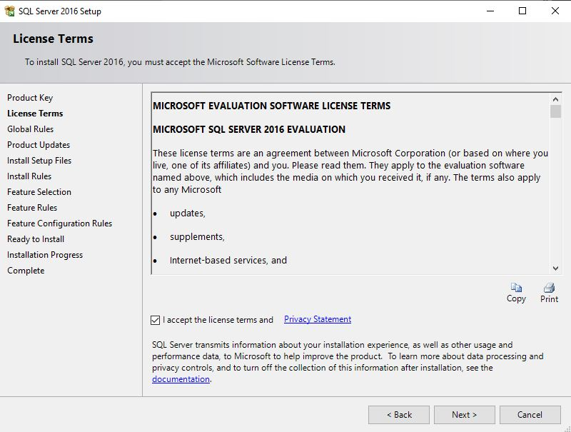
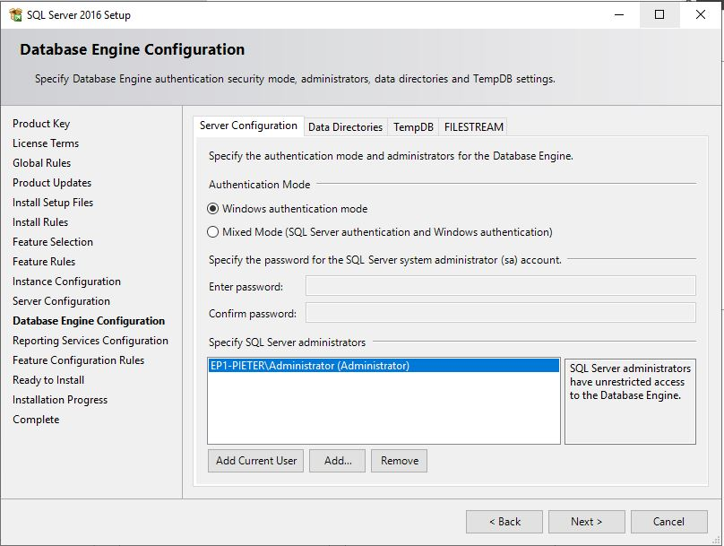

# Opdracht Windows Server 2

- [Opdracht Windows Server 2](#opdracht-windows-server-2)
- [Opdracht Windows Server 2](#opdracht-windows-server-2-1)
- [Documentatie Windows Server 2](#documentatie-windows-server-2)
  - [1. Domeincontroller (EP1-DC-ALFA)](#1-domeincontroller-ep1-dc-alfa)
    - [1.1 ADDS](#11-adds)
    - [1.2 DNS](#12-dns)
    - [1.3 DHCP](#13-dhcp)
  - [2. Webserver (EP1-WEB)](#2-webserver-ep1-web)
    - [Internet Information Services (IIS)](#internet-information-services-iis)
  - [3. Deploymentserver (EP1-SCCM)](#3-deploymentserver-ep1-sccm)
    - [Microsoft Endpoint configuration manager (MECM)](#microsoft-endpoint-configuration-manager-mecm)
    - [Windows Deployment Services (WDS)](#windows-deployment-services-wds)
  - [4. Certificatieserver (EP1-CA)](#4-certificatieserver-ep1-ca)
    - [Active Directory Certificate Services (AD CS)](#active-directory-certificate-services-ad-cs)
- [Handleiding Windows Server 2](#handleiding-windows-server-2)
  - [1. Algemeen](#1-algemeen)
    - [1.1 Virtuele machine aanmaken](#11-virtuele-machine-aanmaken)
    - [1.2 Installatie Windows Server 2019](#12-installatie-windows-server-2019)
      - [1.2.1 De vm opstarten](#121-de-vm-opstarten)
    - [1.3 Gedeelde map toevoegen](#13-gedeelde-map-toevoegen)
    - [1.4 Script uitvoeren](#14-script-uitvoeren)
  - [2. Domeincontroller (EP1-DC-ALFA)](#2-domeincontroller-ep1-dc-alfa)
    - [2.1 Domeincontroller: Initial Setup](#21-domeincontroller-initial-setup)
    - [2.2 Active Directory Domain Services (ADDS)](#22-active-directory-domain-services-adds)
    - [2.3 DNS](#23-dns)
      - [Nat routing](#nat-routing)
    - [2.4 DHCP](#24-dhcp)
  - [3. Webserver (EP1-WEB)](#3-webserver-ep1-web)
    - [3.1 Webserver: Initial Setup](#31-webserver-initial-setup)
    - [3.2 Webserver: Join Domain](#32-webserver-join-domain)
    - [3.3 Webserver: installatie rollen](#33-webserver-installatie-rollen)
  - [4. Deploymentserver (EP1-SCCM)](#4-deploymentserver-ep1-sccm)
    - [4.1 Deploymentserver: Initial Setup](#41-deploymentserver-initial-setup)
    - [4.2 Deploymentserver: Join Domain](#42-deploymentserver-join-domain)
    - [4.3 Deploymentserver: installatie benodigdheden](#43-deploymentserver-installatie-benodigdheden)
      - [4.3.1 Delegate control](#431-delegate-control)
      - [4.3.2 Unzip sccm bestanden](#432-unzip-sccm-bestanden)
      - [4.3.3 Install benodigde roles and features](#433-install-benodigde-roles-and-features)
      - [4.3.4 Configure IIS](#434-configure-iis)
      - [4.3.5 Installeer Windows ADK](#435-installeer-windows-adk)
        - [4.3.5.1 ADK](#4351-adk)
        - [4.34.5.2 Windows adk PE-Addon](#43452-windows-adk-pe-addon)
        - [4.3.5.3 SQL server](#4353-sql-server)
        - [4.3.5.4 SSMS](#4354-ssms)
        - [4.3.5.5 SCCM](#4355-sccm)
    - [4.4 configuratie SCCM](#44-configuratie-sccm)
      - [4.4.1 Verifieer](#441-verifieer)
      - [4.4.2 Administration](#442-administration)
        - [4.4.2.1 Enable Active directory Forest Discovery](#4421-enable-active-directory-forest-discovery)
        - [4.4.2.2 Enable Active directory System Discovery](#4422-enable-active-directory-system-discovery)
        - [4.4.2.3 Enable Active directory User Discovery](#4423-enable-active-directory-user-discovery)
        - [4.4.2.4 Create boundaries](#4424-create-boundaries)
        - [4.4.2.5 Automatic client push](#4425-automatic-client-push)
        - [4.4.2.6 Distribution group](#4426-distribution-group)
      - [4.4.3 Updating SCCM Configuration manager](#443-updating-sccm-configuration-manager)
      - [4.4.4 Creating packages](#444-creating-packages)
        - [4.4.4.1 Content distribution](#4441-content-distribution)
        - [4.4.4.2 Add Besturingssysteem](#4442-add-besturingssysteem)
        - [4.4.5.1 Windows Deployment Services](#4451-windows-deployment-services)
        - [4.4.5.2 PXE setup](#4452-pxe-setup)
      - [4.4.6 MDT](#446-mdt)
        - [4.4.6.1 Installeer MDT](#4461-installeer-mdt)
        - [4.4.6.2 Integrate MDT met SCCM](#4462-integrate-mdt-met-sccm)
        - [4.4.6.3 MDT Task sequence](#4463-mdt-task-sequence)
  - [5. Certificatieserver (EP1-CA)](#5-certificatieserver-ep1-ca)
    - [5.1 Certificatieserver: Initial Setup](#51-certificatieserver-initial-setup)
    - [5.2 Certificatieserver: Join Domain](#52-certificatieserver-join-domain)
    - [5.3 Certificatieserver: installatie en configuratie benodigdheden](#53-certificatieserver-installatie-en-configuratie-benodigdheden)
  - [6. Client deployen (EP1-CLTy)](#6-client-deployen-ep1-clty)
    - [6.1 VM aanmaken in virtualbox](#61-vm-aanmaken-in-virtualbox)
    - [6.2 Client opstarten](#62-client-opstarten)

---

# Opdracht Windows Server 2


- Domeincontroller
  - OS: Windows 2019
  - Naam: EP1-DC-ALFA
  - IP instellingen:
    - `192.168.10.200/24`
- Web server
  - OS: Windows 2019
  - Naam: EP1-WEB
  - IP instellingen
    - `192.168.10.220/24`
- Deployment server
  - OS: Windows 2019
  - Naam: EP1-SCCM
  - IP instellingen:
    - `192.168.10.225/24`
- Certificaat server
  - OS: Windows 2019
  - Naam: EP1-CA
  - IP instellingen:
    - `192.168.10.230/24`

# Documentatie Windows Server 2

## 1. Domeincontroller (EP1-DC-ALFA)

De domeincontroller staat in voor de noodzakelijke dingen te regelen binnen het netwerk.

### 1.1 ADDS

Active directory maakt het mogelijk om gebruikersaccounts aan te maken op netwerk. Hiermee kan elke gebruiker inloggen op een computer binnen het netwerk met zijn eigen account.  
Als je bijvoorbeeld denkt aan een schoolomgeving. Iedere student heeft zijn eigen account en meldt zich aan op een computer van de school. Als hij zich inlogt in lokaal A en daar een word-document maakt dan is het mogelijk dat hij in lokaal B kan verderwerken aan het word-document.

### 1.2 DNS

DNS gaat er voor zorgen dat IP adressen kunnen worden omgezet naar hostnames en andersom.

### 1.3 DHCP

Om de domeincontroller IP adressen te laten uitdelen moeten we hiervan een DHCP-server maken.
Dit zorgt er voor dat de rol DHCP server zal geinstalleerd worden alsook het aanmaken van een DHCP scope waar kan instellen welke addressen er worden uitgedeeld en welke niet.

## 2. Webserver (EP1-WEB)

De webserver is redelijk vanzelfsprekend. Dit is een webpagina waar gebruikers kunnen naar surfen.

### Internet Information Services (IIS)

Dit is de rol waarin je de website kan configureren. Je kan hier bijvoorbeeld ook meegeven dat je de website enkel over _http_, _https_ of beide kan bereiken.

## 3. Deploymentserver (EP1-SCCM)

Om efficiënt nieuwe computers te installeren in het netwerk gaan we een deploymentserver opzetten. Hier kan je dan via het netwerk een besturingssysteem installeren op de computer alsook software die je nodig hebt binnen het netwerk.

### Microsoft Endpoint configuration manager (MECM)

Wij gaan de Endpoint manager gaan gebruiken om:

- __Applicaties__ uit te sturen in het netwerk.
- __Clients__ te installeren.
- __Capture__ te nemen van bestaande clients.

### Windows Deployment Services (WDS)

__WDS__ maakt het mogelijk om via pxe-boot een client te gaan installeren of te capturen.

## 4. Certificatieserver (EP1-CA)

Om de webserver te bezoeken via __HTTPS__ hebben we nood aan een certificaat en dit wordt gegenereerd door de certificaatserver.

### Active Directory Certificate Services (AD CS)

Met AD CS kunt u een PKI (Public Key Infrastructure) bouwen en uw organisatie voorzien van public key cryptografie, digitale certificaten en digitale handtekeningmogelijkheden.

Wanneer u digitale servercertificaten gebruikt voor de authenticatie tussen computers in uw netwerk, bieden de certificaten:

- Vertrouwelijkheid door encryptie.
- Integriteit door digitale handtekeningen.
- Authenticatie door certificaatsleutels te koppelen aan computer-, gebruikers- of apparaataccounts in een computernetwerk.

# Handleiding Windows Server 2

> Opgelet! Voordat we beginnen gelievie alle bestanden in het archief `benodigdheden Deplymentserver.zip` uit te pakken in het de map `scripts/configfiles` te stoppen.

## 1. Algemeen

Alles wat onder algemeen te vinden is kan je toepassen op alle server die binnen de opdracht vallen van Windows Server 2

### 1.1 Virtuele machine aanmaken

Maak binnen de hypervisor naar keuze een virtuele machine aan met volgende specificaties:

- minimum 1 processorkern
- minimum 2 Gb werkgeheugen
- 1 netwerkadapter op "Intern netwerk"

> Opgelet! Als je een domeincontroller wil maken kies je voor 2 netwerkadapters:
>
> - 1 Nat netwerkadapter
> - 1 Intern netwerkadapter
>
> Opgelet! Indien je een domeincontroller wil maken zorg dat dat de nat netwerkadapter op adapter 1 staat. Anders gaat het [initial setup](../scripts/domeincontroller/1_initial_setup.ps1) script de adapters fout configureren.

### 1.2 Installatie Windows Server 2019

Nadat je de virtuele machine hebt aangemaakt kan je het besturingssysteem installeren (in ons geval is dit Windows Server 2019)

Heb je nog niet een virtuele machine aangemaakt dan kan je dit doen aan de hand van volgende handleiding, [Virtuele machine aanmaken](#virtuele-machine-aanmaken)

Om te beginnen moet je de het installatiebestand (.iso) toevoegen aan de opslag van de vm (virtuele machine). Dit kan je doen in VirtualBox door de instellingen te openen van de vm en te navigeren naar het tabje "Opslag".

#### 1.2.1 De vm opstarten

- Start de vm op.
- Doorloop de wizard voor het installeren van Windows Server 2019
- Klik op "Install now"
- Selecteer de gepaste versie die je wilt installeren, in ons geval is dit "Windows Server 2019 Standard (Desktop Experience)".
  - Wij nemen hier de Desktop Experience omdat we een grafische user interface willen.
- Lees en accepteer, indien u akkoord bent, de license terms.
- Kies voor "Custom: Install Windows Only (Advanced)"
- Selecteer de schijf/partitie waarop u Windows wil installeren en kies vervolgens voor next
- Wacht tot de installatie voltooid is.
- Kies een wachtwoord voor het administrator account. Ik koos `Admin2021` als wachtwoord.

Nu is het besturingssysteem geïnstalleerd. Als je VirtualBox gebruikt gelieve dan ook de Guest additions te installeren zodat we in de toekomst gedeelde mappen kunnen gebruiken.

### 1.3 Gedeelde map toevoegen

In virtualbox kan je een gedeelde map toevoegen via `Apparaten` --> `Gedeelde mappen` --> `Instellingen gedeelde mappen...`


Maak een nieuwe gedeelde map aan met de knop rechts


Vul het dialoogvenster in:

- Pad naar map: Map alle scripts zich bevinden op je lokale computer.
- Naam van map: naam van de gedeelde map binnen de virtuele machine
- vink automatisch koppelen aan
- koppelpunt: stel dit in op `F:\`, anders hebben we later problemen bij het uitvoeren van de scripts.
- vink permanent maken aan.


### 1.4 Script uitvoeren

Navigeer naar `F:\` binnen de virtuele machine.

>De scripts zijn _logisch_ ingedeeld per computer, wil je een _domeincontroller_ installeren navigeer dan naar `F:\domeincontroller` wil je een script uitvoeren dat algemeen is? bijvoorbeeld [join_domain.ps1](../scripts/algemeen/join_domain.ps1) zoek dan in de map _algemeen_


Om een script uit te voeren selecteer je het script en via _rechtermuisklik_ selecteer je _Run with Powershell_


## 2. Domeincontroller (EP1-DC-ALFA)

Om een domeinstructuur op te zetten hebben we een domeincontroller nodig. Deze gaat er ook voor zorgen dat er internet beschikbaar is binnen ons netwerk.

> Alle scripts voor de domeincontroller bevinden zicht in `F:\domeincontroller`

### 2.1 Domeincontroller: Initial Setup

Na een clean install van het besturingssysteem, in ons geval Windows Server 2019, kan je overgaan tot het instellen van hostname, netwerkadapters, ... Dit doen we met het script [1_initial_setup.ps1](../scripts/domeincontroller/1_initial_setup.ps1). De configuratie hiervan kan je eventueel aanpassen in het [settingsbestand](../scripts/domeincontroller/settings.json). Na het uitvoeren van het script zal de computer automatisch herstarten.

Het [initial setup](../scripts/domeincontroller/1_initial_setup.ps1) script gaat:

- computernaam instellen
- Windows updates uitschakelen __(in een productieomgeving is dit ten zeerste afgeraden)__
- Netwerkadapters goed instellen
  - Ip-adressen instellen (statisch of via dhcp)
  - Naamgeving van netwerk adapters
  - IPv6 uitschakelen

```json
{
    "Hostname": "EP1-DC-ALFA",
    "Network": [
        {
            "Name": "WAN",
            "DHCP": "True",
            "IPAdress": ""
        },
        {
            "Name": "LAN10",
            "DHCP": "False",
            "IPAdress": "192.168.10.200"
        }
    ]
}
```

### 2.2 Active Directory Domain Services (ADDS)

Het script [2_adds.ps1](../scripts/domeincontroller/2_adds.ps1) zorgt ervoor dat de role `Active Directory Domain Services` geinstalleerd en geconfigureerd wordt.  
Het gaat de rol `Active Directory Domain Services` installeren en daarna de server promoveren naar een domeincontroller.  
Tijdens de promotie worden de domeinnaam, netbiosnaam en safemode administrator wachtwoord ingesteld uit de [algemene settings](../scripts/settings.json).  
De computer zal opnieuw opstarten en vanaf dan kan je inloggen met het domain administrator account:

- gebruikersnaam: `EP1-PIETER\Administrator`
- Wachtwoord dat je gekozen hebt, bij mij is dit `Admin2021`

```json
{
    "ADDS": {
        "DomainName": "EP1-PIETER.hogent",
        "NetBiosName": "EP1-PIETER",
        "password": "Admin2021"
    }
}
```

| Variabele     | Uitleg                                                                                                                                                 |
| :------------ | :----------------------------------------------------------------------------------------------------------------------------------------------------- |
| `DomainName`  | Domeinnaam. Hier vul je de naam in dat je wil instellen voor het domein.                                                                               |
| `NetBiosName` | Netbiosnaam. Dit kan je vergelijken met een roepnaam. als ik wil inloggen als domeinadministrator gebruik ik de netbiosnaam `EP1-PIETER\Administrator` |
| `password`    | Dit is een wachtwoord dat je moet gebruiken als de computer opstart in Safe mode, of een variant hiervan.                                              |

### 2.3 DNS

Voer het script [3_dns_routing.ps1](../scripts/domeincontroller/3_dns_routing.ps1) uit zodat dns geconfigureerd wordt.  
Dit gaat een reverse lookupzone aanmaken en de server configureren als nat router.

Voer het script [3_dns_routing.ps1](../scripts/domeincontroller/3_dns_routing.ps1) uit zodat dns geconfigureerd wordt.  
Dit gaat een reverse lookupzone aanmaken en daarna de rol `Remote access` installeren. De instellingen hiervan kan je vinden in het [algemene settingsbestand](../scripts/settings.json)

Nadat het script uitgevoerd is moeten we het _Ptr record_ genereren. Navigeer hiervoor naar _Tools_ --> _DNS_ in de server manager.  
Navigeer naar de forward lookup-zone `EP1-PIETER.hogent` en zoek het record met als data het ip adres van de LAN10 interface. (`192.168.10.200`). Open het eigenschappenvenster met rechtermuisklik en vink _Update associated pointer (PTR) record_ aan.


> Een _reverse lookup zone_ zorgt ervoor dat een IP-adres omgezet wordt naar de juist netwerk naam.

#### Nat routing

Configureer de domeincontroller als een nat router.
Dit doe je via _Servermanager_ --> _Tools_ --> _Routing and Remote Access_

Rechtermuisklik op `EP1-DC-ALFA (local)` en kies voor _Configure and Enable Routing and Remote Access_


Doorloop de wizard en kies voor _Network address translation (NAT)_

  

En selecteer dan de interface naar het internet, bij ons is dit `WAN`.  


Doorloop verder de wizard.

```json
{
    "DNS": {
        "NetworkID": "192.168.10.0/24"
    }
}
```

| Variabele   | Uitleg                        |
| :---------- | :---------------------------- |
| `NetworkID` | Het netwerkID in CIDR-notatie |

### 2.4 DHCP

Om de domeincontroller IP adressen te laten uitdelen moeten we hiervan een DHCP-server maken. Dit kan je doen met het script [4_DHCP.ps1](../scripts/domeincontroller/4_dhcp.ps1).
Dit zorgt er voor dat de rol DHCP server zal geinstalleerd worden alsook het aanmaken van een DHCP scope waar kan instellen welke addressen er worden uitgedeeld en welke niet. Wat er precies zal geconfigureerd worden kan je vinden in het [settingsbestand](../scripts/domeincontroller/settings.json).

```json
{
    "DHCP": {
        "scopeName": "HoGent-EP1",
        "ScopeDescr": "De scope voor het toewijzen van ip-adressen in het netwerk.",
        "scopeStartIp": "192.168.10.100",
        "scopeEndIp": "192.168.10.150",
        "scopeSubnetMask": "255.255.255.0",
        "scopeLease": "8.00:00:00"
    }
}
```

| Variabele         | Uitleg                                                                                              |
| :---------------- | :-------------------------------------------------------------------------------------------------- |
| `scopeName`       | De naam van de DHCP-scope die je gaat aanmaken.                                                     |
| `ScopeDescr`      | Een gepaste beschrijving voor die scope die je gaat aamaken.                                        |
| `scopeStartIp`    | Het __begin__ van de range van ip-adressen die de dhcp server mag uitdelen.                         |
| `scopeEndIp`      | Het __einde__ van de range van ip-adressen die de dhcp server mag uitdelen.                         |
| `scopeSubnetMask` | Het subnetmask van de ip adressen die de dhcp scope mag uitdelen.                                   |
| `scopeLease`      | De lease tijd is hoelang de dchp server een ip-adres mag "uitlenen" voor het moet vernieuwd worden. |

## 3. Webserver (EP1-WEB)

> Alle scripts voor de webserver bevinden zicht in `F:\webserver`

### 3.1 Webserver: Initial Setup

Na een [clean install](#installatie-windows-server-2019) van het besturingssysteem, in ons geval Windows Server 2019, kan je overgaan tot het instellen van computernaam, ip-adressen, ... Dit doen we met het script [1_initial_setup.ps1](../scripts/webserver/1_initial_setup.ps1). De configuratie hiervan kan je eventueel aanpassen in het [settingsbestand](../scripts/webserver/settings.json).

Het [initial setup](../scripts/Webserver/1_initial_setup.ps1) script gaat:

- Hostname instellen
- Windows updates uitschakelen __(in een productieomgeving is dit ten zeerste afgeraden)__
- Netwerkadapters goed instellen
  - Ip-adressen instellen (statisch)
  - Naamgeving van netwerk adapters
  - IPv6 uitschakelen

```json
{
    "Hostname": "EP1-WEB",
    "Network": [
        {
            "Name": "LAN10",
            "DHCP": "False",
            "IPAdress": "192.168.10.220"
        }
    ]
}
```

### 3.2 Webserver: Join Domain

Om het domein te joinen voer je het script [Join_domain.ps1](../scripts/algemeen/join_domain.ps1) uit. Na het uitvoeren van het script zal de computer automatisch herstarten.

> Opgelet! Dit script bevindt zich in `F:\algemeen`

nadat dit uitgevoerd is en de computer herstart is kan je inloggen met het netwerk administrator account `EP1-PIETER\Administrator`

### 3.3 Webserver: installatie rollen

Om de benodigde rollen te installeren voer je het script [2_install_webserver.ps1](../scripts/webserver/2_install_webserver.ps1) uit. Dit gaat alle nodige rollen installeren maar nog niet configureren.

## 4. Deploymentserver (EP1-SCCM)

> Alle scripts voor de deploymentserver bevinden zicht in `F:\deploymentserver`

### 4.1 Deploymentserver: Initial Setup

Na een [clean install](#installatie-windows-server-2019) van het besturingssysteem, in ons geval Windows Server 2019, kan je overgaan tot het instellen van computernaam, ip-adressen, ... Dit doen we met het script [1_initial_setup.ps1](../scripts/webserver/1_initial_setup.ps1). De configuratie hiervan kan je eventueel aanpassen in het [settingsbestand](../scripts/webserver/settings.json).

Het [initial setup](../scripts/deploymentserver/1_initial_setup.ps1) script gaat:

- Hostname instellen
- Windows updates uitschakelen __(in een productieomgeving is dit ten zeerste afgeraden)__
- Netwerkadapters goed instellen
  - Ip-adressen instellen (statisch)
  - Naamgeving van netwerk adapters
  - IPv6 uitschakelen

```json
{
    "Hostname": "EP1-SCCM",
    "Network": [
        {
            "Name": "LAN10",
            "DHCP": "False",
            "IPAdress": "192.168.10.225"
        }
    ]
}
```

### 4.2 Deploymentserver: Join Domain

Na de [Initial Setup](#deploymentserver-initial-setup) is het tijd om het domein te joinen. hiervoor voer je het script [Join_domain.ps1](../scripts/algemeen/join_domain.ps1) uit. Na het uitvoeren van het script zal de computer automatisch herstarten.

> Opgelet! Dit script bevindt zich in `F:\algemeen`

Nadat dit uitgevoerd is en de computer herstart is kan je inloggen met het netwerk administrator account `EP1-PIETER\Administrator`

### 4.3 Deploymentserver: installatie benodigdheden

Nu gaan we de nodige programma's downloaden:

Download [deze programma's](https://hogent-my.sharepoint.com/:u:/g/personal/pieter_vankeer_student_hogent_be/ETf9xuuoCyZCuZoH5EAtA_cB4-VkWMSh0dkNX4TV0-BIjQ?e=B1QIyu) en plaats deze in de map `scripts/configfiles`.

#### 4.3.1 Delegate control

> Deze stap moet gebeuren op de __Domeincontroller__.

Voer het script `5_prepare_sccm.ps1` uit.  

Ga binnen de __Domeincontroller__ naar _Server manager_ --> _Tools_ --> _Active directory Users and Computers_


Selecteer _view_ --> _advanced Features_


Navigeer nu naar _System_ en zoek voor een container genaamd _System Management_


Rechtermuisklik op deze container en selecteer _Delegate Control_

Een wizard opent. Doorloop deze wizard.

Klik op _add_


Verander _Object types_ zodat _computers_ aangevinkt is.  
Typ vanonder in het invulveld `EP1-SCCM` (dit is de computernaam van de Deploymenyserver) en klik daarna op _Check names_

> Als de computer gevonden is dan zal deze onderstreept zijn.  

Klik op _ok_ om verder te gaan en klik daarna op _Next_





#### 4.3.2 Unzip sccm bestanden

> Nu werken we terug op de __Domeincontroller__
> De scripts hiervoor bevinden zich in de map `F:\domeincontroller`

Voer op de __Domeincontroller__ het script `6_install_sccm.ps1` uit.  
Een venster zal verschijnen en klik hier op _unzip_


#### 4.3.3 Install benodigde roles and features

> Deze stap moet uitgevoerd worden op de _Deploymentserver_

Voer het script `2_install_sccm.ps1` uit.

Dit script gaat Volgende rollen en features installeren:

- Background intelligent transfer service (BITS)
- Remote differantial compression
- .net framework 3.5
- IIS components
  - Common HTTP features
    - Static content
    - Default document
    - Directory browsing
    - HTTP error
    - HTTP redirection
    - WebDAV Publishing
  - Application development
    - ASP.NET 3.5 en 4.7
    - .NET extensibility 3.5 en 4.7
    - ASP
    - ISAPI extensions
    - ISAPI filters
  - Health and diagnostics
    - HTTP logging
    - Custom logging
    - Logging tools
    - Request monitor
    - Tracing
  - Security
    - Request filtering
    - Basic authentication
    - Client certificate mapping authentication
    - URL authorization
    - IP and domain restrictions
    - Windows authentication
  - Performance
    - Static content compression
  - Management tools
    - IIS management console
    - IIS manegement Scripts and tools
    - Management Service
    - IIS 6 Management Compatibility
      - IIS 6 Metabase compatibility
      - IIS 6 WMI compatibility
      - IIS 6 scripting tools
      - IIS 6 Management console

#### 4.3.4 Configure IIS

Open via de _server manager_ --> _tools_ --> _Internet information services manager_  
en navigeer naar _default web site_ en selecteer _Authentication_


Zorg dat _Anonymous Authentication_ op _Enabled_ staat.


#### 4.3.5 Installeer Windows ADK

Nu gaan we de Windows ADK installeren, daarna ook nog Windows SQL server.

Run het script `3_install_adk.ps1`.

##### 4.3.5.1 ADK

Kies voor _open_



Kies voor _run_

  
  
  
  
  
  
  

##### 4.34.5.2 Windows adk PE-Addon

  
  
  
  
  
  

##### 4.3.5.3 SQL server

Kies voor _Custom_

  
  
  
  
  
  
  
  
  
  
  
  

Vul Account name in met `EP1-PIETER\Administrator` en het wachtwoord met je zelf gekozen wachtwoord.

  

Klik op _Add current user_ en daarna op _next_

  
  

Klik op _install_
  

  
##### 4.3.5.4 SSMS


Kies voor _Restart_


Na het herstarten hebben we SQL server en Sql server management studio geïnstalleerd.
Nu is het tijd om SCCM te installeren.

##### 4.3.5.5 SCCM

Run het script `4_install_sccm.ps1`

Hier komt dezelfde pop-up terug zoals op de domeincontroller. Klik op _Unzip_ en daarna op close


Nadat je de bestanden die nodig zijn voor sccm te installeren hebt unzipt gaan we over tot de installatie van sccm.

Je krijgt volgend scherm te zien en kies hier voor _install_

  
  
  

> Wij kiezen voor de evaluation edition omdat dit een proof of concept is maar in een productieomgeving kies je voor _install the licensed edition of this product_

  
  

Nu zal de installatie beginnen van de updates. Kies daarna de gewenste taal.

  
  
  
  

Bij een eventuele pop-up dan bevestig je met _Yes_.

  
  
  
  
  
  
  


Kies voor _Begin Install_

  
  
  

### 4.4 configuratie SCCM

Voer het script `5_verify_sccm.ps1` uit.

Hierbij zal de sccm console openen. Dit kan even duren.

#### 4.4.1 Verifieer

Kijk na dat `site` en `database` goed werken door linksonder naar de workspace _Monitoring_ te navigeren.  
Binnen _Monitoring_ het mapje _System status_ te openen en hierin op _Site status_ te klikken. Deze zouden allemaal een groen vinkje moeten hebben.

  

#### 4.4.2 Administration

Ga nu naar de workspace _Administration_ en klik door naar _Hierarchy Configuration_ --> _Discovery Methods_  

##### 4.4.2.1 Enable Active directory Forest Discovery

Open met rechtermuisklik de _properties_ van _Active directory Forest Discovery_  
Vink alles aan en klik op _ok_

  

Als er een prompt komt klik dan op _Yes_

##### 4.4.2.2 Enable Active directory System Discovery

Open met rechtermuisklik de _properties_ van _Active directory System Discovery_  
Vink _Enable Active Directory System Discovery_ aan

Klik rechts op het geel icoontje


En vul bovenaan in het invulveld Path het volgende in: `CN=Computers,DC=EP1-PIETER,DC=hogent`


Klik op OK


Klik op YES

##### 4.4.2.3 Enable Active directory User Discovery

Ga nu naar de workspace _Administration_ en klik door naar _Hierarchy Configuration_ --> _Discovery Methods_  
Open met rechtermuisklik de _properties_ van _Active directory System Discovery_

Vink _Enable Active Directory System Discovery_ aan

Klik rechts op het geel icoontje

  

En vul bovenaan in het invulveld Path het volgende in: `CN=Users,DC=EP1-PIETER,DC=hogent` en klik op _browse_, daarna op _ok_

  

Klik op OK

  

Klik op YES

##### 4.4.2.4 Create boundaries

Navigeer binnen de _Administration_ workspace naar _Boundaries_

  
  

Navigeer binnen de _Administration_ workspace naar _Boundaries groups_

  
  

Navigeer binnen de _Administration_ workspace naar _Active Directory Forests_ en verifier dat er 1 bestaat

  

Navigeer nog een laatste maal naar _Discovery methods_ voer een system discorvery scan uit

  

Navigeer nu naar _Assets and Complaince__ --> _Devices_ en controleer of er bekende toestellen tussenkomenstaan.

> Let op! dit kan lang duren, ongeveer een 10 minuten.


##### 4.4.2.5 Automatic client push

navigeer naar _Sites_ en klik op _Client Installation Settings_ --> _Client push installation_

  
  

##### 4.4.2.6 Distribution group

Navigeer naar _Administration_ --> _Distribution points_

  

Rechtermuisklik en open _properties_ en ga naar tabblad _Boundary groups_.  
Voeg met add de juiste boundary group toe.

  

klik op ok  
Navigeer nu naar _Distribution group_ --> rechtermuisklik --> _Create group_  
Geef een gepaste naam en kies via _add_ de gepaste server.

  

Ga naar _Boundarie groups_ en selecteer de aangemaakte boundarie group. open properties (rechtermuisklik --> properties)
en vink _use this boundary group for site assignment_ aan onder het tabblad _References_

  

Navigeer naar _Distribution group points_ --> open de properties (rechtermuisklik --> properties) --> tabblad collections --> _add_ --> vink root aan --> ok --> ok

  

Navigeer naar _sites_ --> open _Hierarchy settings_ (rechtermuisklik --> _Hierarchy settings_) --> vink _Clients prefer to use management points in boundary groups_ aan

  

#### 4.4.3 Updating SCCM Configuration manager

Ga naar _Updates and servicing_ en installeer beschikbare updates

  

#### 4.4.4 Creating packages

Navigeer binnen de _Software Library_ workspace naar _Packages_

  

Rechtermuisklik --> _create package_ om een package toe te voegen

Vul de nodige info in

##### 4.4.4.1 Content distribution

Rechtermuisklik op een package --> _Distribute content_ --> next --> add --> distribution point --> selecteer een distribution point. --> deploy

##### 4.4.4.2 Add Besturingssysteem

Navigeer naar de workspace _Software Library_ --> _Operating Systems_ --> Rechtermuisklik op _Operating system images_

  

Importeer het gewenste besturingssysteem. Na het importeren gaan we het besturingssysteem distribueren

  

Doorloop de wizard en klik op _add_ --> _distribution point_ --> kies hier uw gewenste distribution point.

Na het doorlopen van de wizard wacht dan tot de distributie voltooid is.

  

##### 4.4.5.1 Windows Deployment Services

Open in de server manager --> _Tools_ --> _Windows Deployment Services_

  
  
  
  
  

##### 4.4.5.2 PXE setup

In _SCCM_ ga naar de workspace _Administration_ --> _Distribution points_ --> open de properties van het distribution point

  

klik ok

#### 4.4.6 MDT

##### 4.4.6.1 Installeer MDT

Gebruik hiervoor het script `6_install_mdt.ps1`

##### 4.4.6.2 Integrate MDT met SCCM

In _SCCM_ ga naar _Administration workspace_ --> _Sites_.  
Rechtermuisklik op _Sites_ --> _Hierarchy Settings_ --> Zorg dat _Only allow console extension that are approved for the hierarchy_ __NIET__ aangevinkt is.


Open het windows menu (links beneden) en zoek naar de map _Microsoft Deployment Toolkit_, Klik deze map open en open het programma _Configure ConfigMgr Integration_

  
  
  

##### 4.4.6.3 MDT Task sequence

Navigeer binnen _SCCM_ naar de workspace _Software Library_ --> _Operating systems_ --> Rechtermuisklik op _Task sequences_ --> __

  
  
  
  
  

Als u deze nog niet heeft aangemaakt kiest u voor de andere optie.

  

Kies hier uw gewenste besturingssysteem

  
  
  
  
  
  

klik op _next_ --> _next_ en _close_

Nadat je de task sequence hebt aangemaakt moet je deze _Deployen_

Rechtermuisklik op de task sequence en kies voor _deploy_

## 5. Certificatieserver (EP1-CA)

> Alle scripts voor de certificatieserver bevinden zicht in `F:\certificaatserver`

### 5.1 Certificatieserver: Initial Setup

Na een [clean install](#installatie-windows-server-2019) van het besturingssysteem, in ons geval Windows Server 2019, kan je overgaan tot het instellen van computernaam, ip-adressen, ... Dit doen we met het script [1_initial_setup.ps1](../scripts/certificaatserver/1_initial_setup.ps1). De configuratie hiervan kan je eventueel aanpassen in het [settingsbestand](../scripts/certificaatserver/settings.json).

Het [initial setup](../scripts/deploymentserver/1_initial_setup.ps1) script gaat:

- Hostname instellen
- Windows updates uitschakelen __(in een productieomgeving is dit ten zeerste afgeraden)__
- Netwerkadapters goed instellen
  - Ip-adressen instellen (statisch)
  - Naamgeving van netwerk adapters
  - IPv6 uitschakelen

```json
{
    "Hostname": "EP1-CA",
    "Network": [
        {
            "Name": "LAN10",
            "DHCP": "False",
            "IPAdress": "192.168.10.230"
        }
    ]
}
```

### 5.2 Certificatieserver: Join Domain

Na de [Initial Setup](#certificatieserver-initial-setup) is het tijd om het domein te joinen. hiervoor voer je het script [Join_domain.ps1](../scripts/algemeen/join_domain.ps1) uit. Na het uitvoeren van het script zal de computer automatisch herstarten.

> Opgelet! Dit script bevindt zich in `F:\algemeen`

nadat dit uitgevoerd is en de computer herstart is kan je inloggen met het netwerk administrator account `EP1-PIETER\Administrator`

### 5.3 Certificatieserver: installatie en configuratie benodigdheden

Nadat de [computer in het domein](#certificatieserver-join-domain) zit kan je overgaan tot nodige rollen te installeren. Dit kan je doen met het script [2_install_ca.ps1](../scripts/certificaatserver/2_install_ca.ps1)

Dit script gaat de rol `Active Directory Certificate Services` installeren en configureren. Er zal een Enterprise root CA geconfigureerd worden.

## 6. Client deployen (EP1-CLTy)

### 6.1 VM aanmaken in virtualbox

In virtualbox klik bovenaan op nieuw

  

Geef de vm een gepaste naam

  

Doorloop de wizard en neem overal de default instellingen

Nu de vm aangemaakt is geen we de instellingen aanpassen. Open de instellingen van de vm.

Bij het setie _systeem_

Configureer je de _opstartvolgorde_ zoals onderstaand:

- [X] Netwerk
- [X] Harde schijf
- [ ] Optisch
- [ ] Diskette

Navigeer nu naar de sectie netwerk

Configureer de adapter naar _intern netwerk_. Zorg er voor dat het intern netwerk dat we aangemaakt hebben geselecteerd is. `WinServ`

### 6.2 Client opstarten

- Start de client op en wacht tot er iets verschijnt als `Press F12 for PXE boot`
- Druk op `F12`
- Kies de task sequence dat je wil laten lopen
- Laat de client installeren

Nadat de installatie doorlopen is. Kan je in SCCM nakijken dat er een nieuw device is.
